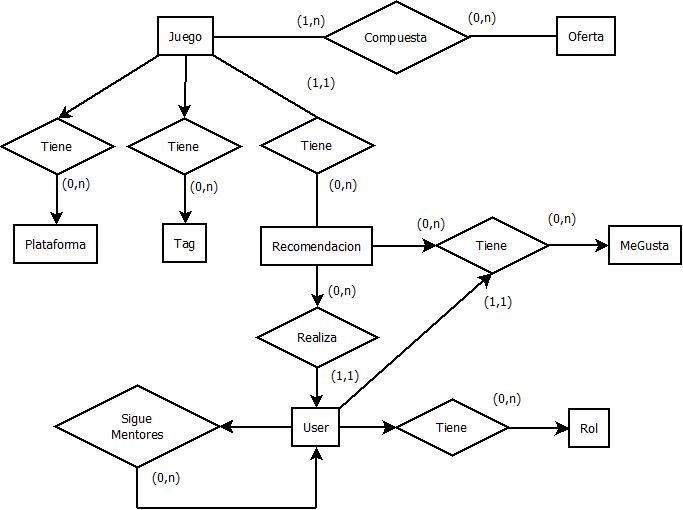

# DAW

#Nombre de la aplicacion web
	CODEGAMING
#Intrucciones de uso
	Instalar node.js version 4 o superior, a continuacion instalar angular (npm install -g angular-cli@0.0.24), crear un proyecto y copiar en el la carpeta src el src de nuestro proyecto. Por último, abrir la consola en la carpeta del proyecto y ejecutar el comando'ng serve' y abrir en el navegador la direccion: "http://localhost:4200/". Estos pasos han sido comprobados en Windows 10.
#Descripcion
	Tematica: Analisis y venta online de videojuegos
	Funcionalidades publicas: Catalogo y analisis
	Funcionalidades privadas: Carrito de compra, valoracion de videojuegos, lista de deseados, capacidad de ser o tener mentores, ver perfil de usuarios(juegos comprados, valoraciones, etc).

#Entidades
5 entidades principales ->
	- Usuario: cuenta con datos personales con la capacidad de realizar cualquier accion de funcionalidad publica y privada.
	- Producto: videojuego a la venta con X precio, con comentarios, una valoracion, una cantidad en stock y una o varias categorias.
	- Categoria de productos: listado de productos ordenados por categorias como por ejemplo accion, rpg, deportes, etc.
	- Pedido: encargo de uno o varios productos.
	- Analisis: comentarios y valoracion dada por los usuarios sobre el producto.
Otras entidades ->
	- Oferta: rebajas o packs de productos, asi como codigos de promocion.
	- Lista de deseados: lista de productos que a un usuario le gustaria adquirir.
	- Mentores: personas que recomiendan videojuegos, que ellos crean que sean buenos.
	- Carrito de compra: lista de productos a comprar previa al pedido.
	- Stock: numero de productos disponibles.
#Diagrama de navegacion ->

#Diagrama de clases cliente ->

#Captura de pantalla de las paginas principales ->
-Pagina principal 
 

 
-Catalogo 
 

 
-Mentores 
 

 

 

 
-Ofertas 
 

#Integrantes del equipo de desarrollo
	- David Vacas Miguel, d.vacas@alumnos.urjc.es, valli22
	- Diego Jimenez Fernandez-Pacheco, d.jimenezfer@alumnos.urjc.es, Zigic23
	- Miguel Roldan Alcala, m.roldana@alumnos.urjc.es, miguelr95
	- Pedro Redondo Rabanal, p.redondor@alumnos.urjc.es, dropelega
#Diagrama de base de datos ->

#Diagrama de base de datos ->

#TRELLO
https://trello.com/b/cImjlED9/daw